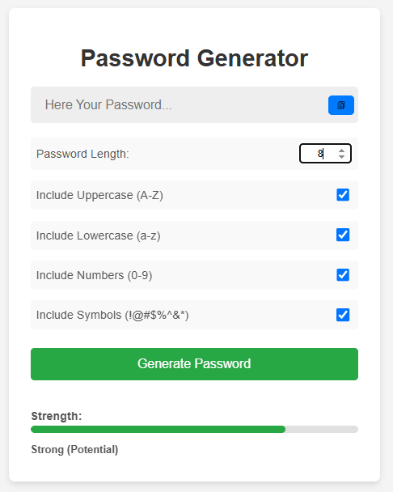
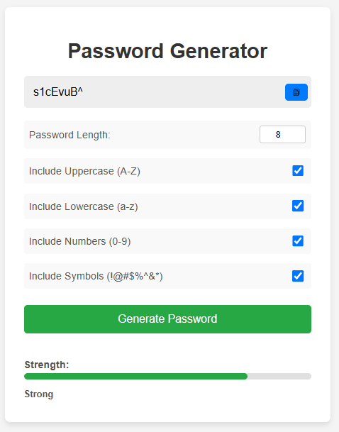

# Password Generator 🔑

A simple web application to generate strong, random passwords based on user-defined criteria. This project is built entirely with HTML, CSS, and vanilla JavaScript, making it a great example of front-end development fundamentals.

**Home Page**


**After Password Genarated**


## Features

*   **Customizable Length:** Specify the desired password length (between a minimum and maximum range).
*   **Character Type Selection:** Choose to include or exclude:
    *   Uppercase Letters (A-Z)
    *   Lowercase Letters (a-z)
    *   Numbers (0-9)
    *   Symbols (!@#$%^&*...)
*   **Instant Generation:** Generate a new password with the click of a button.
*   **Copy to Clipboard:** Easily copy the generated password using a dedicated button.
*   **Password Strength Indicator:** Provides visual feedback (a colored bar) and a text label (Weak, Medium, Strong, Very Strong) indicating the estimated strength of the generated password or the potential strength based on selected options.
*   **User-Friendly Interface:** Simple and intuitive layout.

## Technologies Used

*   **HTML5:** Structures the content of the web page.
*   **CSS3:** Styles the appearance and layout of the application.
*   **JavaScript (ES6+):** Handles:
    *   User input (length, character types)
    *   Password generation logic (random character selection, shuffling)
    *   DOM manipulation (displaying password, updating strength indicator)
    *   Event handling (button clicks, option changes)
    *   Clipboard interaction (copy functionality)

## Setup and Installation

Since this is a purely front-end project, setup is very straightforward:

1.  **Clone the repository:**
    ```bash
    git clone https://github.com/ashen694/password-generator.git
    cd password-generator
    ```

2.  **No API Keys Needed:** Unlike the Weather App, this project does not require any external API keys.

3.  **Open the Application:**
    *   Simply open the `index.html` file directly in your web browser (e.g., by double-clicking it).
    *   Alternatively, if you use VS Code with the "Live Server" extension, you can right-click `index.html` and choose "Open with Live Server".

## How to Use

1.  Open the `index.html` file in your browser.
2.  Use the number input to set the desired password length.
3.  Check the boxes next to the character types you want to include in your password (Uppercase, Lowercase, Numbers, Symbols).
4.  The strength indicator will update based on your selected options (Potential strength).
5.  Click the "Generate Password" button.
6.  A random password meeting your criteria will appear in the display box. The strength indicator will update to reflect the *actual* strength of the generated password.
7.  Click the "Copy" button (clipboard icon or text) next to the password display to copy it to your clipboard. You'll see a brief "Copied!" confirmation.

## License

This project is open source and available under the [MIT License](LICENSE).  